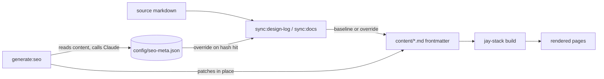

# Design Log #06 — SEO Metadata Generation

## Background

Markdown-synced pages get their `<title>` and `<meta name="description">` from frontmatter via
`@jay-framework/markdown` (`markdown-pages`). This covers two large, auto-generated sections:

- **Design logs** — `/design-log/{jay,wix,website}/[slug]`, synced by `scripts/sync-design-log.cjs`.
- **Docs** — `/docs/{role}/[slug]`, synced by `scripts/sync-agent-kit-docs.cjs`.

Both read `{post.title}` / `{post.description}` from each file's frontmatter. The page templates
wrap the title with a branding suffix, e.g. `<title>{post.title} — Jay Design Log</title>`.

### Related

- DL#03 — Agent Kit Documentation Pages (docs sync)
- DL#02 — Multi-Repo Design Log Sync (design-log sync)

## Problem

`npm run validate -- --from-build` validates the final rendered pages (dynamic `[slug]` routes
expanded). It surfaced ~474 SEO issues the template-only pass can't see:

1. **336 empty descriptions** — source markdown mostly has no `description` frontmatter, so
   `{post.description}` rendered empty.
2. **138 over-length titles** — long technical titles plus the branding suffix pushed `<title>`
   past the recommended 60 characters.
3. A handful of **over-160 descriptions** and, once descriptions were populated, **unresolved-binding
   errors** when prose contained `{...}` (jay-html binding syntax).

Two constraints make this hard to fix naively:

- **`content/` is gitignored and regenerated on every sync** — editing the synced markdown doesn't
  persist; fixes must live in the sync scripts or in committed source.
- **The build must stay deterministic and offline** — `sync:*` runs inside `build:production` (CI),
  so it cannot depend on a non-deterministic, network-bound LLM call.

## Questions and Answers

**Where should generated metadata live so it survives re-syncs?**
In a committed cache, `config/seo-meta.json`, keyed by route and invalidated by a **content hash**
so only new or changed docs are (re)generated.

**Agent-authored or deterministic extraction?**
Both — a **hybrid**. A deterministic baseline guarantees every page has valid metadata with zero
cost and no network; agent-authored copy is an optional override layered on top for quality.

**How do we keep the build deterministic while still using an agent?**
Generation is **decoupled** from the build. `generate:seo` writes the cache; the sync scripts only
*read* it. A missing or stale cache degrades to the baseline — it never blanks or breaks a page.

**How do we keep `<title>` ≤ 60 without truncating the body title?**
`{post.title}` is also used in the page body (the sr-only `<h1>`, and the docs sidebar's visible
`activePageTitle`). So the frontmatter title is budgeted to `60 − suffix.length` for the section,
and each template's branding suffix was shortened (dropped `| Jay Framework`).

**Why did populated descriptions cause errors?**
Prose like `{role}` or `{post.title}` copied into a `<meta>` is parsed as a (never-resolved)
binding. Descriptions and titles are sanitized to strip `{}`.

## Design

Two layers, one shared module:



- **`scripts/seo-meta.cjs`** — shared helper. Content hashing (`bodyHash`, frontmatter-stripped and
  trimmed so it matches on both sides), deterministic `extractDescription` (first prose paragraph,
  skipping frontmatter/headings/blockquotes/code/images), `titleBudgetFor` (per-section suffix map),
  `sanitizeMeta` (strip `{}`), and `resolveSeo` (cache override else baseline).
- **Sync scripts** — inject `title` (budgeted) + `description` into frontmatter via `resolveSeo`.
- **`scripts/generate-seo.mjs`** (`npm run generate:seo`) — walks synced docs; for each content-hash
  miss, asks Claude for a title + description, writes the cache, and patches the synced file in place.
  It calls Claude through `@anthropic-ai/claude-agent-sdk` (the aiditor's SDK), which authenticates
  with the local `claude login` credentials — so no `ANTHROPIC_API_KEY` is required.
- **`config/seo-meta.json`** — the committed override cache (empty until first generation).

The per-section suffix map in `seo-meta.cjs` is the single source of truth for the title budget and
**must stay in sync with the literal `<title>` suffix in each `page.jay-html`**.

## Implementation Plan

1. `seo-meta.cjs` — hashing, extraction, budgeting, sanitization, cache load/save, `resolveSeo`.
2. `sync-design-log.cjs` / `sync-agent-kit-docs.cjs` — rebuild frontmatter with `title` + `description`
   (design-log merges into existing frontmatter rather than skipping it).
3. Shorten the `<title>` suffix in all 8 `[slug]` templates to match the budget map.
4. `generate-seo.mjs` + `generate:seo` — agent overrides via `@anthropic-ai/claude-agent-sdk`
   (local `claude login` credentials), hash-gated, in-place patch, graceful skip when the agent is
   unavailable.
5. `build:production` runs `generate:seo` after the syncs and before `jay-stack build`.

## Examples

Cache entry (`config/seo-meta.json`), keyed by route, invalidated by body hash:

```json
{
  "docs/developer/routing": {
    "hash": "a1b2c3d4e5f60718",
    "title": "Directory-Based Routing",
    "description": "How Jay maps the pages directory to routes, including dynamic [slug] segments and param discovery."
  }
}
```

Resulting frontmatter the sync writes into `content/`:

```markdown
---
title: "Directory-Based Routing"
description: "How Jay maps the pages directory to routes, including dynamic [slug] segments and param discovery."
---
```

Title budget (design-log/jay): suffix `" — Jay Design Log"` is 17 chars, so the frontmatter title is
truncated to **43** so `title + suffix ≤ 60`.

## Trade-offs

- **In-place patch vs one-build lag.** `generate:seo` patches the synced `content/` files directly so
  the same build renders agent copy. Without it, agent copy would lag one build (sync applies the
  cache, but sync ran before generation). The committed cache remains the source of truth across syncs;
  `content/` edits are ephemeral.
- **Graceful degradation.** Agent unavailable (not logged in / offline) → `generate:seo` warns and
  skips; the deterministic baseline carries the build. Production builds never hard-fail over SEO.
- **Auth reuse over a separate key.** Generation goes through `@anthropic-ai/claude-agent-sdk`, which
  reuses the `claude login` credentials. This avoids a second, console-only `ANTHROPIC_API_KEY` that
  wouldn't otherwise be configured (an env key is still honored if present).
- **Cost is bounded.** Generation is hash-gated (only new/changed docs) and defaults to a small model
  (`claude-haiku-4-5`, override via `SEO_MODEL`), so steady-state builds make zero API calls.
- **Baseline quality.** The first-paragraph excerpt is adequate but generic; agent overrides are the
  quality path. The baseline guarantees correctness, not polish.
